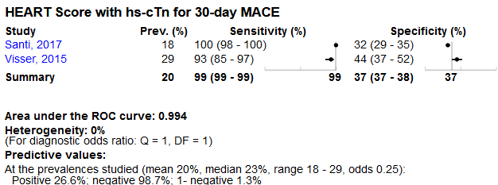

Chest pain: risk stratification
============================================
A living systematic review

Short url: https://openMetaAnalysis.github.io/Chest-pain-stratification

**Clinical summary:** This meta-analysis suggests that clinical intervention *is or is not* effective. Heterogeneity of results as measured by I2 was '[moderate](http://handbook-5-1.cochrane.org/chapter_9/9_5_2_identifying_and_measuring_heterogeneity.htm)' at XX%. This review updates the previously published meta-analysis.(1)

Meta-regression dooes not find modulators (year of publication, study size, event rate in the control groups) on the effect of the intervention.
* [Reconciliation of conclusions with prior meta-analyses](files/reconciliation-tables/Reconciliation%20of%20conclusions.pdf) (under construction)
* [Keep current with this topic](files/searching/Keep-up.md) (under construction)

Acknowledgement: we acknowledge the essential work by the authors of the prior systematic review(s) listed below.

**Methods overview:** This repository is an [openMetaAnalysis](https://openmetaanalysis.github.io/) that combines methods of scoping, rapid, and living systematic reviews.  This analysis updates one or more previously published review(s) below. A comparison of studies included in this review compared to prior reviews are in the table, [reconciliation of trials included with prior meta-analyses/](files/reconciliation-tables/Reconciliation%20of%20studies.pdf). Newer studies included are listed in the references below. Rationale for newer trials excluded may be listed at the end of the references. 
* [Methods](http://openmetaanalysis.github.io/methods.html) for openMetaAnalysis
* [Evidence search](files/searching/evidence-search.md) for this review (under construction)

**Results:** Details of the studies included are in the:
* [Reconciliation of trials included with prior meta-analyses/](files/reconciliation-tables/Reconciliation%20of%20studies.pdf) (under construction)
* [Description of studies (PICO table)](files/study-details/table-pico.pdf) (under construction)
* [Risk of bias assessment](files/study-details/table-bias.pdf) (under construction)
* [Forest plots](../master/files/forest-plots) ([source data](files/data))
* [Network plots](../master/files/network) (optional)
* [Reconciliation of conclusions with prior meta-analyses](files/reconciliation-tables/Reconciliation%20of%20conclusions.pdf) (under construction)

The forest plot for the primary outcomes are below. Additional [forest plots](files/forest-plots) of secondary analyses may be available. 

The meta-regression for the primary outcomes are below. Additional [meta-regressions](files/metaregression) of secondary analyses may be available. 

References:
----------------------------------

### Systematic review(s)
#### Most recent review at time of last revision of this repository
1. Fernando SM, Tran A, Cheng W, Rochwerg B, Taljaard M, Thiruganasambandamoorthy
V, Kyeremanteng K, Perry JJ. Prognostic Accuracy of the HEART Score for
Prediction of Major Adverse Cardiac Events in Patients Presenting With Chest
Pain: A Systematic Review and Meta-analysis. Acad Emerg Med. 2018 Oct 29. doi:
[10.1111/acem.13649](http://dx.doi.org/10.1111/acem.13649). PMID: [30375097](http://pubmed.gov/30375097). *Encourages the HEART Score*
2. Van Den Berg P, Body R. The HEART score for early rule out of acute coronary
syndromes in the emergency department: a systematic review and meta-analysis. Eur
Heart J Acute Cardiovasc Care. 2018 Mar;7(2):111-119. doi:
[10.1177/2048872617710788](http://dx.doi.org/10.1177/2048872617710788). PMID: [28534694](http://pubmed.gov/28534694) *Discourages the Heart score*
3. Fanaroff AC, Rymer JA, Goldstein SA, Simel DL, Newby LK. Does This Patient
With Chest Pain Have Acute Coronary Syndrome?: The Rational Clinical Examination 
Systematic Review. JAMA. 2015 Nov 10;314(18):1955-65. doi:
[10.1001/jama.2015.12735](http://dx.doi.org/10.1001/jama.2015.12735). PMID: [26547467](http://pubmed.gov/26547467) *Recommends HEART or TIMI risk scores. *

###Practice guidelines
Amsterdam EA, Wenger NK, Brindis RG, Casey DE Jr, Ganiats TG, Holmes DR Jr,
Jaffe AS, Jneid H, Kelly RF, Kontos MC, Levine GN, Liebson PR, Mukherjee D,
Peterson ED, Sabatine MS, Smalling RW, Zieman SJ; ACC/AHA Task Force Members.
2014 AHA/ACC guideline for the management of patients with non-ST-elevation acute
coronary syndromes: a report of the American College of Cardiology/American Heart
Association Task Force on Practice Guidelines. Circulation. 2014 Dec
23;130(25):e344-426. doi: [10.1161/CIR.0000000000000134](http://dx.doi.org/10.1161/CIR.0000000000000134). PMID: [25249585](http://pubmed.gov/25249585)

### Diagnostic test assessments
#### New assessments(s) *not* included in the most recent review above
Pending

### Randomized controlled trials
#### New trial(s) *not* included in the most recent review above
Pending

#### Trial(s) included in the review above
Pending

#### Trial(s) undergoing review
Pending

#### Trial(s) excluded - selected list of important trial(s)

#### Cited by
This repository is cited by:

1. WikiDoc contributors. Pending content page. WikiDoc. Nov 9, 2014. Available at: http://www.wikidoc.org/index.php/This_topic. Accessed November 9, 2014. 

-------------------------------
[Cite and use this content](https://github.com/openMetaAnalysis/openMetaAnalysis.github.io/blob/master/reusing.MD)  - [Edit this page](../../edit/master/README.md) - [License](files/LICENSE.md) - [History](../../commits/master/README.md)  - 
[Issues and comments](../../issues?q=is%3Aboth+is%3Aissue)

